# Claude Code 多智能体工作流系统

[](https://opensource.org/licenses/MIT)
[](https://claude.ai/code)
[](https://github.com/)
[](https://docs.claude.com/en/docs/claude-code/plugins)

> 企业级敏捷开发工作流自动化与多智能体编排

[English](README.md)

## 🚀 BMAD 方法论：敏捷开发自动化

**BMAD (Business-Minded Agile Development)** 将您的开发流程转换为全自动化的敏捷工作流，配备角色化 AI 智能体和质量门控。

### 一条命令，完整工作流

```bash
/bmad-pilot "构建电商结账系统，集成支付功能"
# 自动化：产品 → 架构 → 冲刺 → 开发 → 审查 → 测试
```

## 🎯 BMAD 工作流架构

```mermaid
graph LR
    PO[产品负责人] -->|PRD 90+| Architect[架构师]
    Architect -->|设计 90+| SM[Scrum Master]
    SM -->|冲刺计划| Dev[开发者]
    Dev -->|代码| Review[审查]
    Review -->|Pass/Fail| QA[测试]
    QA -->|测试| Done[完成]
```



### 核心特性

- **🤖 6个专业智能体**：PO、Architect、SM、Dev、Review、QA
- **📊 质量门控**：90% 阈值自动优化
- **✅ 确认节点**：关键阶段用户确认
- **📁 持久化产物**：所有文档保存至 `./.claude/specs/`
- **🔄 迭代优化**：自动改进直至质量达标

## 📋 BMAD 智能体与角色

| 智能体 | 角色 | 质量门控 | 输出 |
|--------|------|----------|------|
| **bmad-po** (Sarah) | 产品需求收集 | 90/100 PRD 评分 | `01-product-requirements.md` |
| **bmad-architect** (Winston) | 技术设计与架构 | 90/100 设计评分 | `02-system-architecture.md` |
| **bmad-sm** (Mike) | 冲刺计划与任务分解 | 用户确认 | `03-sprint-plan.md` |
| **bmad-dev** (Alex) | 功能实现 | 代码完成 | 实现文件 |
| **bmad-review** | 独立代码审查 | Pass/Risk/Fail | `04-dev-reviewed.md` |
| **bmad-qa** (Emma) | 测试与质量保证 | 测试执行 | `05-qa-report.md` |

## 🚀 快速开始

### 安装方法

#### 方法1：插件系统（推荐）🎯

```bash
# 列出所有可用插件
/plugin list

# 安装特定工作流插件
/plugin install bmad-agile-workflow         # BMAD 方法论
/plugin install requirements-driven-development  # Requirements 工作流
/plugin install development-essentials      # 核心开发命令
/plugin install advanced-ai-agents         # GPT-5 集成

# 查看插件详情
/plugin info bmad-agile-workflow
```

#### 方法2：传统安装

```bash
# 克隆仓库
git clone https://github.com/your-repo/claude-code-workflows.git
cd claude-code-workflows

# 使用 make 安装所有配置
make install

# 或部署特定工作流
make deploy-bmad          # 仅部署 BMAD 工作流
make deploy-requirements  # 仅部署 Requirements 工作流
make deploy-all          # 部署所有命令和智能体
```

### 基本 BMAD 工作流

```bash
# 完整敏捷工作流（所有阶段）
/bmad-pilot "用户认证系统，支持 OAuth2 和多因素认证"

# 快速原型（跳过测试）
/bmad-pilot "管理后台" --skip-tests

# 直接开发（跳过冲刺计划）
/bmad-pilot "修复登录问题" --direct-dev

# 跳过仓库扫描（使用现有上下文）
/bmad-pilot "添加功能" --skip-scan
```

### 工作流产物

每次 BMAD 运行创建结构化文档：

```
.claude/specs/user-authentication/
├── 00-repository-context.md    # 仓库分析
├── 01-product-requirements.md  # PRD 及业务目标
├── 02-system-architecture.md   # 技术设计
├── 03-sprint-plan.md           # 冲刺任务
├── 04-dev-reviewed.md          # 代码审查报告（v3.1 新增）
└── 05-qa-report.md            # 测试结果
```

## 🎨 BMAD 输出样式

BMAD 工作流使用专门的输出样式：
- 创建阶段隔离的上下文
- 管理智能体交接
- 跟踪质量评分
- 处理确认门控
- 支持 Codex CLI 集成

## ⚡ v3.2 插件系统

### 🔌 原生插件支持（新增）
本项目现已包含原生 Claude Code 插件支持，提供4个即装即用的插件包：

#### 可用插件

| 插件 | 描述 | 命令 | 智能体 |
|------|------|------|--------|
| **bmad-agile-workflow** | 完整 BMAD 方法论及角色化智能体 | `/bmad-pilot` | bmad-po, bmad-architect, bmad-sm, bmad-dev, bmad-qa |
| **requirements-driven-development** | 精简需求工作流 | `/requirements-pilot` | requirements-generate, requirements-code, requirements-review |
| **development-essentials** | 核心开发命令 | `/code`, `/debug`, `/test`, `/optimize` | code, bugfix, debug, develop |
| **advanced-ai-agents** | GPT-5 深度分析集成 | - | gpt5 |

#### 使用插件

```bash
# 列出所有可用插件
/plugin list

# 获取插件详细信息
/plugin info bmad-agile-workflow

# 安装插件以激活其命令和智能体
/plugin install requirements-driven-development

# 移除已安装的插件
/plugin remove development-essentials
```

#### 插件配置
插件定义在 `.claude-plugin/marketplace.json`，遵循 Claude Code 插件规范。每个插件包含：
- 命令（斜杠命令）
- 智能体（专业 AI 智能体）
- 元数据（版本、作者、关键词）
- 类别分类

## ⚡ v3.1 特性

### 独立代码审查智能体
- **bmad-review**：Dev 和 QA 之间的自动审查
- **双版本支持**：
  - 标准版：Claude Code 原生审查
  - 增强版：通过 Codex CLI 调用 GPT-5
- **三级状态**：Pass / Pass with Risk / Fail

### 增强工作流
- Dev → Review → QA 质量链
- 自动更新冲刺计划
- 针对性 QA 测试建议

## 📊 质量评分系统

### PRD 质量（100分）
- 业务价值：30
- 功能需求：25
- 用户体验：20
- 技术约束：15
- 范围与优先级：10

### 架构质量（100分）
- 设计质量：30
- 技术选型：25
- 可扩展性：20
- 安全性：15
- 可行性：10

### 审查状态
- **Pass**：无问题，进入 QA
- **Pass with Risk**：非关键问题
- **Fail**：必须返回 Dev

## 🔧 高级用法

### 仓库上下文
BMAD 自动扫描仓库了解：
- 技术栈
- 项目结构
- 现有模式
- 依赖关系
- 编码规范

### 交互式优化
每个阶段支持迭代改进：
```
PO: "这是 PRD（评分：75/100）"
用户: "添加移动端支持和离线模式"
PO: "更新的 PRD（评分：92/100）✅"
```

### 确认门控
关键阶段需要明确确认：
```
架构师: "技术设计完成（评分：93/100）"
系统: "准备继续？(yes/no)"
用户: yes
```

---

## 🏭 Requirements-Driven 工作流

适用于简单项目的轻量级替代方案：

```bash
/requirements-pilot "实现 JWT 认证"
# 自动化：需求 → 代码 → 审查 → 测试
```

### 特性
- 90% 质量门控
- 自动优化循环
- 实现导向规格
- 实用主义优先

## 🛠️ 其他命令

### 开发命令
- `/ask` - 技术咨询
- `/code` - 直接实现
- `/debug` - 系统化调试
- `/test` - 测试策略
- `/review` - 代码验证
- `/optimize` - 性能优化
- `/bugfix` - 错误解决
- `/refactor` - 代码改进
- `/docs` - 文档生成
- `/think` - 高级分析

### 手动工作流示例
```bash
/ask "实时消息的设计模式"
/code "实现 WebSocket 服务器"
/test "创建集成测试"
/review "验证安全性"
```

## 📄 许可证

MIT 许可证 - 查看 [LICENSE](LICENSE) 文件

## 🙋 支持

- **文档**：查看 `/commands/` 和 `/agents/` 目录
- **插件指南**：查看 [PLUGIN_README.md](PLUGIN_README.md) 了解插件系统详情
- **问题**：GitHub issues 用于报告 bug 和功能请求
- **Makefile 帮助**：运行 `make help` 查看所有部署选项
- **Claude Code 文档**：[插件系统](https://docs.claude.com/en/docs/claude-code/plugins)

### 可用的 Make 命令

```bash
make install              # 安装所有配置到 Claude Code
make deploy-bmad         # 仅部署 BMAD 工作流
make deploy-requirements # 仅部署 Requirements 工作流
make deploy-commands     # 部署所有斜杠命令
make deploy-agents       # 部署所有智能体配置
make test-bmad          # 测试 BMAD 工作流示例
make test-requirements  # 测试 Requirements 工作流示例
make clean              # 清理生成的文件
make help               # 显示所有可用命令
```

---

**使用 BMAD 转型您的开发** - 一条命令，完整敏捷工作流，质量保证。

*通过 `/plugin install bmad-agile-workflow` 安装或使用传统安装方法。*

*让专业的 AI 智能体处理专业工作。*
